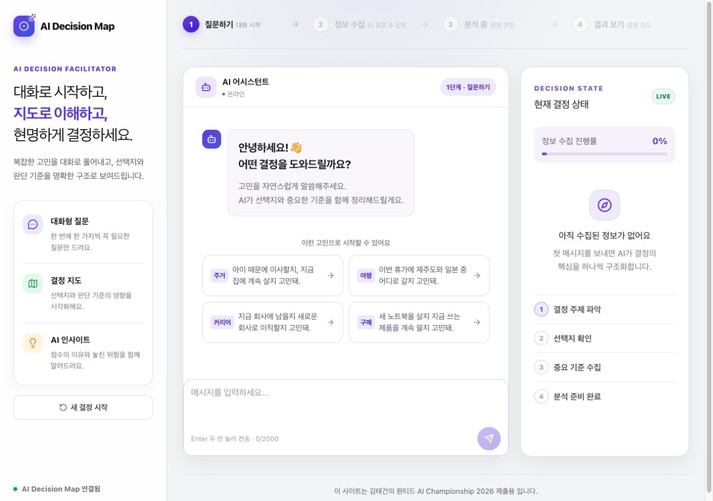

# AI Decision Map

### 망설임을 근거 있는 다음 행동으로

고민을 대화로 풀어내고, 선택지의 장단점과 판단 근거를 시각적으로 비교하는 **응원형 의사결정 코칭 서비스**입니다. 단순히 점수를 나열하는 대신, 사용자가 중요하게 생각하는 가치와 마음의 방향을 바탕으로 **왜 이 선택이 적합한지, 무엇을 확인하고 실행하면 좋을지** 제안합니다.

[서비스 바로가기](https://ai-decision.tetelab.dev) · [제출 문안](docs/submission/wanted-2026/원티드_제출문안.md) · [배포 가이드](docs/DEPLOY.md)



> **개발 현황:** 1차 MVP 구현 완료. 2차 개발로 고민 유형별 Three.js 결정 지도를 연결했습니다. 도시·섬·저울·쇼룸·생활권을 자동 추천하거나 직접 선택할 수 있습니다.

## 해결하려는 문제

이직, 이사, 구매처럼 정답이 하나가 아닌 결정에서는 정보가 많아도 내 우선순위와 감정을 정리하기 어렵습니다. AI Decision Map은 고민을 좁히는 질문, 선택의 이유와 부담 비교, 작은 실행 계획을 통해 다음 행동으로 나아가도록 돕는 것을 목표로 합니다.

## 사용 흐름

**고민 입력 → 핵심 질문과 선택지 정리 → 기준별 상대 평가 → AI 분석 → 결정 지도·대안 비교·액션 플랜**

| 단계 | 제공하는 경험 |
| --- | --- |
| 대화 | 자유 입력과 답변 칩으로 선택지·우선순위·제약을 정리합니다. 일반 칩은 즉시 전송하고 직접 입력은 작성 후 전송합니다. |
| 평가 | 두 선택지는 기준마다 한 번의 상대 평가로 비교합니다. 점수는 사용자 선호를 정리하는 참고값입니다. |
| 결정 지도 | 고민에 따라 도시·섬·저울·쇼룸·생활권을 표시합니다. 대안과 기준을 선택하면 실제 분석 근거를 확인합니다. 기본은 고정 시점이며 탐색 모드에서 이동할 수 있습니다. |
| 비교 요약 | 대안별 적합한 조건, 기대 효과, 확인할 부담을 비교합니다. 점수표와 가중치 변화 그래프는 보조 자료입니다. |
| AI 인사이트 | 대화 근거와 가정을 구분하고 추천 이유·다른 대안·결론이 달라질 조건을 설명합니다. |
| 액션 플랜 | 지금 할 일, 필요한 확인 자료, 단계별 완료 조건을 제안합니다. |

## 1차 구현 범위

- **대화 피로도 완화:** 단순 메뉴 선택은 최대 4문항, 일반 고민은 최대 12문항을 기준으로 반복 질문과 추가 입력을 제한합니다.
- **선택지 입력:** `A와 B`, `A / B`, `A vs B` 등을 처리합니다. 모호한 경우 `선택지: 새 노트북 구매 / 현재 노트북 수리`처럼 명시할 수 있습니다.
- **응답 UX:** 사용자 말풍선을 먼저 표시하고 처리 상태를 안내합니다. 빠른 응답은 전송 후 최소 650ms에 표시하며 느린 응답에는 추가 대기를 넣지 않습니다.
- **맥락 기반 조언:** 점수 계산과 LLM 설명 생성을 분리하고 사용자 진술에 연결된 추천·대안·실행 단계를 제공합니다.
- **장애 대응:** AI 호출·응답 검증 실패 시 기본 안내 상태를 표시하고 입력을 보존합니다. 맞춤 분석 실패를 정상 AI 분석처럼 표시하지 않습니다.
- **반응형 UI:** 모바일 입력 글씨 16px 이상, 단일 둥근 포커스 테두리, 카드 내부 비교표 스크롤을 적용했습니다.
- **저장·운영:** MySQL 세션·결과 저장, Flyway 마이그레이션, Docker Compose와 GitHub Actions 배포를 구성했습니다.
- **제출용 푸터:** 한국 시간 2026년 10월 5일까지 제출 안내, 10월 6일부터 tetelab 저작권 문구를 표시합니다. 사용자 기기 시각을 기준으로 전환합니다.

### 응원하되, 근거를 왜곡하지 않습니다

사용자가 마음을 두는 선택에서 얻을 수 있는 긍정적인 변화를 설명하되, 반대 선택의 장점과 실행 부담을 숨기지 않습니다. 근거가 부족하면 단정적인 추천 대신 확인할 조건과 작게 시도할 방법을 제시합니다.

- 점수는 **객관적 품질이나 성공 확률이 아니라 사용자 상대 평가**입니다.
- 입력 충족도 100%는 사실 검증이나 높은 신뢰도를 뜻하지 않습니다.
- 사용자 진술, 가정, AI 추론을 구분합니다. 현재 외부 검색·실시간 가격 조회는 수행하지 않습니다.
- 가중치 변화 그래프는 **중요도를 바꿨을 때의 결과 변화**이며 미래 수익이나 성공 확률 예측이 아닙니다.

상세 정책: [맥락 기반 결정 조언](docs/CONTEXTUAL_ADVICE.md)

## 기술 구성

| 영역 | 사용 기술 |
| --- | --- |
| 프런트엔드 | Next.js 16, React 19, TypeScript, Tailwind CSS 4 |
| 결정 지도 | Three.js 0.180, 절차적 3D 모형, HTML 라벨, 2D 대체 보기 |
| 백엔드 | Spring Boot 3, Kotlin, JDK 21, Gradle |
| 데이터 | MySQL 8, Spring Data JPA, Flyway |
| AI | 백엔드 LLM 연동, 결정 상태 구조화, 맥락 기반 설명과 근거 참조 검증 |
| 운영 | Docker Compose, Nginx Proxy Manager, GitHub Actions |
| 검증 | Vitest, ESLint, 프런트엔드 빌드, JUnit 기반 백엔드 테스트 |

```text
frontend/       화면·대화 UX·결정 지도·결과 시각화
backend/        대화 API·결정 엔진·LLM 연동·데이터 저장
config/         운영 환경변수 예시
docs/           배포·분석 정책·DB 초기화·제출 자료
nginx/          별도 Nginx 사용 시 참고 설정
.github/        main push 자동 배포 워크플로
```

### 분석 처리 구조

1. 대화를 결정 상태로 구조화하고 선택지·기준·진술·가정을 저장합니다.
2. Kotlin 결정 엔진이 가중치를 정규화하고 상대 평가 점수를 계산합니다.
3. LLM이 대화 맥락과 계산 결과를 받아 추천 이유, 장단점, 실행 계획을 보강합니다.
4. 근거 참조와 응답 구조를 검증한 결과를 표시합니다. 이 검사는 외부 사실 검증을 대체하지 않습니다.

## 로컬 실행

필요 환경: Node.js 20.9 이상, npm, JDK 21, 접근 가능한 MySQL 8. 컨테이너 실행에는 Docker와 Docker Compose가 필요합니다.

### 1. 데이터베이스와 환경변수

관리자 계정으로 [DB 초기화 SQL](docs/mysql-bootstrap.sql)을 확인하고 실행합니다. **실행 전에 계정 비밀번호 플레이스홀더를 변경하세요.** 이후 스키마 변경은 Flyway가 관리합니다.

프로젝트 루트에서:

```bash
cp backend/.env.example backend/.env
# MYSQL_URL, MYSQL_USERNAME, MYSQL_PASSWORD,
# LLM_API_KEY 및 사용 가능한 모델 설정을 실제 환경에 맞게 수정
set -a
source backend/.env
set +a
```

`MYSQL_URL`에 `&`가 들어가면 전체 값을 따옴표로 감싸야 `source` 오류를 피할 수 있습니다. API 키와 DB 비밀번호는 Git에 올리지 않으며 LLM 키는 백엔드에만 설정합니다.

### 2. 백엔드 실행

위 환경변수를 불러온 터미널에서:

```bash
cd backend
./gradlew bootRun
```

헬스 체크: `http://localhost:8013/api/v1/health`

### 3. 프런트엔드 실행

프로젝트 루트의 별도 터미널에서:

```bash
cd frontend
cp .env.example .env.local
npm ci
npm run dev
```

접속: `http://localhost:3007` · 로컬 API: `http://localhost:8013`

### 테스트와 빌드

```bash
cd frontend
npm test
npm run lint
npm run build
cd ../backend
./gradlew test build
```

## 주요 API

모든 경로의 접두사는 `/api/v1`입니다.

| 메서드 | 경로 | 역할 |
| --- | --- | --- |
| GET | `/health` | 서비스 상태 확인 |
| POST | `/decisions` | 첫 고민으로 세션 생성 |
| POST | `/decisions/{sessionId}/messages` | 후속 답변 전송 |
| GET | `/decisions/{sessionId}/state` | 결정 상태 조회 |
| POST | `/decisions/{sessionId}/analyze` | 상대 평가와 가중치 분석 |
| POST | `/decisions/{sessionId}/enrich` | 맥락 기반 AI 설명 보강 |
| GET | `/decisions/{sessionId}/result` | 저장된 결과 조회 |

## 배포

운영은 외부 MySQL과 `config/app.env`, `docker-compose.prd.yml`을 사용합니다. 프런트엔드 포트는 **3007**, 백엔드는 **8013**입니다.

```bash
docker compose --env-file config/app.env -f docker-compose.prd.yml config --quiet
docker compose --env-file config/app.env -f docker-compose.prd.yml up --build -d
```

Nginx Proxy Manager가 외부 HTTPS를 종료하고 `/`는 프런트엔드, `/api/`는 백엔드로 HTTP 전달합니다. 동일 도메인 구성에서는 `NEXT_PUBLIC_API_BASE_URL`을 비워 두고 이 값 변경 시 프런트엔드를 다시 빌드합니다.

`main` push 또는 Actions 수동 실행으로 배포합니다. 필요한 Secrets는 `BACKEND_HOST`, `SERVER_USER`, `SSH_PRIVATE_KEY`입니다. 서버의 실제 `config/app.env`는 별도로 준비하며 배포 소스에 포함하지 않습니다.

최초 설정, 프록시·방화벽 주의사항, 로그 확인: [배포 가이드](docs/DEPLOY.md)

## 현재 한계와 2차 개발 방향

| 구분 | 현황 / 다음 작업 |
| --- | --- |
| 결정 지도 | 다섯 유형의 Three.js 장면과 실제 결과 연결 구현. 정교한 모델링·재질 및 실기기 성능 최적화는 후속 과제입니다. |
| 근거 품질 | 대화 근거 참조 검증을 적용. 외부 출처 검증과 다양한 고민에 대한 정확도 평가는 후속 과제입니다. |
| 대화 이해 | 긴 문장과 모호한 후보 표현에서 추출 오류 가능. 질문 반복·선택지 정정 회귀 사례를 확장할 예정입니다. |
| 저장·공유 | 서버 세션·결과 저장은 구현. 사용자용 결과 저장·링크 공유·PDF 버튼 연결은 미완료입니다. |
| 사용성 | 모바일 너비 검사 수행. 실제 iPhone Safari와 저사양 기기의 입력·시각화 검증이 추가로 필요합니다. |
| 효과 검증 | 실제 사용자 의사결정 도움 정도와 응답 지연을 측정할 예정입니다. 검증되지 않은 효과·정확도 수치를 주장하지 않습니다. |

2차 시각화의 우선순위는 **멋진 3D 자체가 아니라 대안의 차이·판단 근거·다음 행동을 더 쉽게 이해하는 경험**입니다. 점수나 사용자 선호를 시각적 성공 확률처럼 표현하지 않고 모바일 가독성과 접근성을 함께 고려합니다.

## 고민 유형별 3D 지도

| 유형 | 장면 | 의미 |
| --- | --- | --- |
| 커리어 | 도로와 빌딩 | 선택지는 구역, 판단 기준은 빌딩 |
| 여행 | 섬과 연결 항로 | 선택지는 섬, 판단 기준은 이정표 |
| 기타 | 무게추가 내려오는 저울 | 중요도 × 상대 평가를 공통 기준별로 반영 |
| 구매·소비 | 제품 모형과 진열대 | 대안의 사용 가치와 확인할 부담 비교 |
| 이사·주거 | 집과 생활 경로 | 대안의 생활 조건 비교 |

- 로컬 시연: [http://localhost:3007/map-preview](http://localhost:3007/map-preview). 가상 데이터만 사용하며 DB/LLM을 호출하지 않습니다.
- 분석 결과의 결정 지도에도 같은 컴포넌트를 사용합니다. 자동 유형 추천은 제목·선택지의 키워드 기반이며 직접 변경할 수 있습니다.
- 세 개 이상 대안은 두 개씩 선택해 비교합니다. 선택하지 않은 대안을 삭제하거나 점수를 바꾸지 않습니다.
- 저울의 미확인 평가는 무게에서 제외하고 별도 안내합니다. 추천 방향에 대한 임의 가산점은 없습니다.
- WebGL 실패 시 2D 비교로 전환합니다. 동작 줄이기, 저울 재생/건너뛰기, 시점 초기화를 제공합니다.
- 화면 밖·백그라운드에서는 애니메이션을 멈추고, 짧은 효과 종료 후에는 변경 시에만 렌더링합니다.
- 현재 모델은 컨셉을 경량 기하 도형으로 구현한 버전입니다. 컨셉 이미지와 동일한 실사 도시 모델이나 실제 지리 정보는 아닙니다.

구조와 검증 방법: [3D 결정 지도 개발 가이드](docs/DECISION_WORLD.md)

## 제출 자료

- [원티드 제출 문안](docs/submission/wanted-2026/원티드_제출문안.md)
- [스크린샷 설명 및 검증 기록](docs/submission/wanted-2026/검증_및_등록가이드.md)
- [제출 자료 ZIP](docs/submission/wanted-2026.zip)

김태건 · tetelab · 원티드 AI Championship 2026 제출 프로젝트

마지막 정리: 2026-09-04 (한국 시간)
